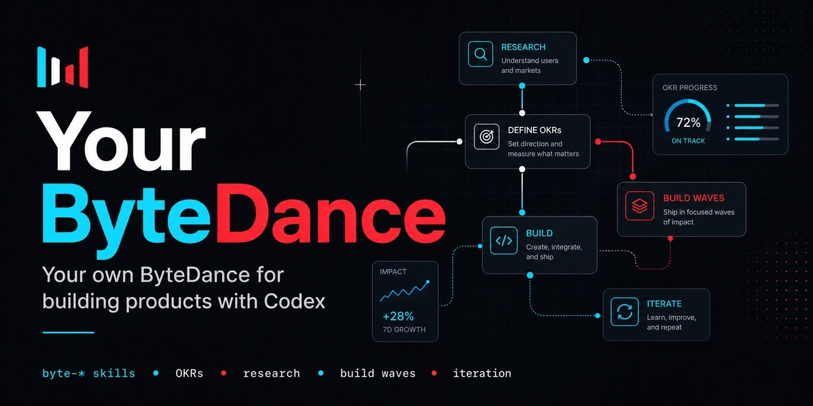

# Your ByteDance Skills



你自己的字节跳动，powered by Codex skills.

Your own ByteDance for building products with Codex.

> ByteDance-inspired, not ByteDance-official. This project is not affiliated with ByteDance.

---

## 中文

**Your ByteDance Skills** 是一套 Codex Skills，用来把一个粗糙的产品想法推进成可交付产品。

它模拟一个受字节跳动工作方式启发的产品小队：产品、市场调研、UX、设计、工程、QA、增长、评审、交付，以及产品完成后的真实用户反馈分析。

底层调用名统一为 `byte-*`。

### 它能做什么

- 从一个模糊想法启动产品。
- 搜索竞品、替代方案、定价、趋势和用户抱怨。
- 定义产品定位、MVP、用户流程、UX 和技术方向。
- 把产品方案拆成带依赖关系的可执行计划。
- 按 execution wave 构建，而不是机械执行 plan 1、plan 2、plan 3。
- 用 Karpathy-inspired 工程守则约束代码：先想清楚、保持简单、只做必要改动、验证成功标准。
- 像跨职能项目组一样做产品、设计、技术、QA、增长评审。
- 在交付前自动迭代至少 3 轮。
- 产品完成后，只基于真实用户证据分析反馈。
- 输出交付说明、运行方式、验证结果和风险。

### 工作方式

Your ByteDance 使用这些工作原则：

- **Always Day 1：** 保持创业心态，减少不必要流程，快速学习。
- **Context, not control：** 把上下文写入 `.byte-os/`，让 agent 基于共享上下文行动。
- **Candid and clear：** 直接暴露问题，区分事实、假设和观点。
- **Seek truth and be pragmatic：** 用市场调研、真实用户证据、测试和指标说话。
- **Aim high with ROI：** 追求高标准，同时关注投入产出比。
- **Transparent OKRs：** 用可见的目标和关键结果连接产品、计划和执行。
- **Experimentation culture：** 把不确定决策转成假设、指标、实验或迭代。
- **Cross-functional squads：** 产品、设计、工程、QA、研究、增长能并行就并行。
- **Engineering discipline：** 写代码时默认遵守 `byte-code-rules`，避免过度设计、无关重构和未验证交付。

### 30 秒快速开始

```bash
git clone https://github.com/elan6666/your-bytedance.git
cd your-bytedance
cp -r byte-* ~/.codex/skills/
```

Windows 通常复制到：

```text
C:\Users\<you>\.codex\skills\
```

然后在 Codex 里使用：

```text
$byte-auto Build an AI study assistant. Iterate 3 times.
```

### 两种流程

逐步推进：

```text
byte-start
byte-shape
byte-plan
byte-build
byte-review
byte-iterate
byte-deliver
```

一键完成：

```text
byte-auto
```

`byte-auto` 会跑同样的阶段，只是不中途等待用户逐步触发，并且默认至少迭代 3 轮。

### Skill 列表

| Skill | 作用 |
|---|---|
| `byte-do` | 自然语言入口，自动路由到合适的 Byte OS skill。 |
| `byte-start` | 初始化 `.byte-os/`，理解想法，创建产品基础上下文。 |
| `byte-research` | 搜索竞品、市场信号、定价、趋势和用户抱怨。 |
| `byte-shape` | 定义定位、MVP、范围、UX、技术方向和路线图。 |
| `byte-plan` | 把产品方案拆成带依赖关系的可执行计划。 |
| `byte-build` | 按 dependency-ready waves 执行计划。 |
| `byte-code-rules` | 写代码、评审、重构、迭代时使用的工程行为守则。 |
| `byte-review` | 做跨职能产品、UX、技术、QA、增长评审。 |
| `byte-iterate` | 基于评审、研究、测试或真实反馈进行结构化迭代。 |
| `byte-users` | 只分析产品完成后的真实用户证据，不模拟用户。 |
| `byte-status` | 查看 Byte OS 当前状态、进度、阻塞和下一步。 |
| `byte-next` | 根据 `.byte-os/` 状态自动推进下一步。 |
| `byte-auto` | 从想法到交付自动跑完整流程，并至少迭代 3 轮。 |
| `byte-deliver` | 打包最终交付说明、运行方式、验证结果和风险。 |

### Byte State

Your ByteDance 会把项目上下文写入：

```text
.byte-os/
  BYTE.md
  STATUS.md
  OKRS.md
  DECISIONS.md
  RESEARCH.md
  COMPETITORS.md
  USER_ASSUMPTIONS.md
  PRODUCT_SPEC.md
  UX_SPEC.md
  TECH_SPEC.md
  ROADMAP.md
  BUILD_LOG.md
  DELIVERY.md
  plans/
  reviews/
  iterations/
  users/
```

这些文件让 skills 可以恢复上下文、记录决策、暴露 OKR、追踪计划和继续推进。

### 使用示例

从想法启动：

```text
$byte-do 我想做一个面向大学生的 AI 学习助手
```

一键跑完整流程：

```text
$byte-auto Build a web app for solo founders to validate product ideas. Iterate 4 times.
```

搜索竞品：

```text
$byte-research 对标 Notion、Linear 和 Trello，帮我找机会点
```

继续下一步：

```text
$byte-next
```

查看进度：

```text
$byte-status
```

分析真实用户反馈：

```text
$byte-users 这里是我们原型测试的用户访谈记录和录屏观察
```

### 重要规则

- `byte-users` 只处理真实的产品完成后用户证据。
- 产品完成前可以有用户假设，但不能假装那是真实用户反馈。
- `byte-build` 默认执行下一批依赖已满足的 wave，不是简单执行第一个 plan。
- `byte-code-rules` 会约束写代码、评审和迭代：简单、克制、可追溯、可验证。
- `byte-auto` 和逐步模式共享同一套阶段，只是自动连续执行。
- 现代竞品、价格、市场趋势或 “latest” 信息必须联网搜索并引用来源。
- 每个阶段都应该更新或遵守当前 Objective、Key Results、决策记录和证据等级。

### 公开资料依据

本项目是 ByteDance-inspired，不是 ByteDance 官方项目。当前工作方式参考了公开材料：

- [ByteDance Culture](https://joinbytedance.com/culture)
- [Lark OKR](https://larksuite.my/okr)
- [TechNode: Feishu People / OKR](https://technode.com/2022/05/26/bytedance-launches-hr-management-tool-feishu-people/)
- [BytePlus A/B Testing Guide](https://www.byteplus.com/downloads/How-to-Avoid-Common-Mistakes-When-AB-Testing.pdf)
- [forrestchang/andrej-karpathy-skills](https://github.com/forrestchang/andrej-karpathy-skills)

---

## English

**Your ByteDance Skills** is a Codex skill suite for turning a rough product idea into a deliverable product.

It simulates a ByteDance-inspired product squad: product, market research, UX, design, engineering, QA, growth, review, delivery, and real post-build user feedback analysis.

All skill names use the `byte-*` prefix.

### What It Does

- Start a product from a rough idea.
- Research competitors, alternatives, pricing, trends, and user complaints.
- Shape product positioning, MVP scope, user flows, UX, and technical direction.
- Split product work into dependency-aware executable plans.
- Build by execution waves instead of blindly running plan 1, plan 2, plan 3.
- Apply Karpathy-inspired engineering rules: think first, keep code simple, make surgical edits, and verify success criteria.
- Review the product like a cross-functional squad.
- Run at least 3 automatic iteration loops before delivery.
- Analyze only real user evidence after the product exists.
- Package delivery notes, run instructions, verification, and risks.

### Operating Model

Your ByteDance applies these principles:

- **Always Day 1:** keep an entrepreneurial mindset, reduce unnecessary process, and learn fast.
- **Context, not control:** write shared context into `.byte-os/` so agents can act from shared memory.
- **Candid and clear:** expose problems directly and separate facts, assumptions, and opinions.
- **Seek truth and be pragmatic:** use market research, real user evidence, tests, and metrics.
- **Aim high with ROI:** push for a higher-standard deliverable while respecting leverage.
- **Transparent OKRs:** connect product goals, plans, and execution to visible objectives and key results.
- **Experimentation culture:** turn uncertain choices into hypotheses, metrics, tests, or iterations.
- **Cross-functional squads:** product, design, engineering, QA, research, and growth work in parallel when dependencies allow.
- **Engineering discipline:** use `byte-code-rules` for coding work to avoid overengineering, unrelated refactors, and unverified delivery.

### 30-Second Quick Start

```bash
git clone https://github.com/elan6666/your-bytedance.git
cd your-bytedance
cp -r byte-* ~/.codex/skills/
```

On Windows, copy the folders to:

```text
C:\Users\<you>\.codex\skills\
```

Then invoke it in Codex:

```text
$byte-auto Build an AI study assistant. Iterate 3 times.
```

### Two Workflows

Step-by-step mode:

```text
byte-start
byte-shape
byte-plan
byte-build
byte-review
byte-iterate
byte-deliver
```

Auto mode:

```text
byte-auto
```

`byte-auto` runs the same stages as step-by-step mode, but continues without waiting after each stage and defaults to at least 3 iteration loops.

### Skill List

| Skill | Purpose |
|---|---|
| `byte-do` | Natural-language router for the Byte OS suite. |
| `byte-start` | Initialize `.byte-os/`, understand the idea, and create product context. |
| `byte-research` | Research competitors, market signals, pricing, trends, and user complaints. |
| `byte-shape` | Define positioning, MVP, scope, UX, technical direction, and roadmap. |
| `byte-plan` | Convert specs into dependency-aware executable plans. |
| `byte-build` | Execute plans by dependency-ready waves. |
| `byte-code-rules` | Engineering behavior rules for coding, review, refactoring, and iteration. |
| `byte-review` | Run a cross-functional product, UX, tech, QA, and growth review. |
| `byte-iterate` | Run structured iteration loops based on review, research, tests, or real feedback. |
| `byte-users` | Analyze real post-build user evidence only. It does not simulate users. |
| `byte-status` | Show current Byte OS state, progress, blockers, and next action. |
| `byte-next` | Infer and execute the next step from `.byte-os/` state. |
| `byte-auto` | Run from idea to delivery automatically with at least 3 iterations. |
| `byte-deliver` | Package final delivery notes, run instructions, verification, and risks. |

### Byte State

Your ByteDance writes state into:

```text
.byte-os/
  BYTE.md
  STATUS.md
  OKRS.md
  DECISIONS.md
  RESEARCH.md
  COMPETITORS.md
  USER_ASSUMPTIONS.md
  PRODUCT_SPEC.md
  UX_SPEC.md
  TECH_SPEC.md
  ROADMAP.md
  BUILD_LOG.md
  DELIVERY.md
  plans/
  reviews/
  iterations/
  users/
```

These files let the skills resume context, record decisions, expose OKRs, track plans, and continue execution.

### Examples

Start from an idea:

```text
$byte-do I want to build an AI study assistant for university students
```

Run the full workflow automatically:

```text
$byte-auto Build a web app for solo founders to validate product ideas. Iterate 4 times.
```

Research competitors:

```text
$byte-research Compare this product against Notion, Linear, and Trello
```

Continue:

```text
$byte-next
```

Check status:

```text
$byte-status
```

Analyze real user feedback:

```text
$byte-users Here are user interview notes and session recordings from our prototype test
```

### Important Rules

- `byte-users` only handles real post-build user evidence.
- User assumptions before build are allowed, but they must not be presented as real user feedback.
- `byte-build` executes the next dependency-ready wave by default, not simply the first plan.
- `byte-code-rules` constrains coding, review, and iteration to be simple, scoped, traceable, and verifiable.
- `byte-auto` uses the same staged workflow as manual mode; it just runs the stages continuously.
- Modern competitor, pricing, market, or "latest" claims require current web research and citations.
- Every stage should update or respect the current Objective, Key Results, decision log, and evidence level.

### Public Research Basis

This suite is ByteDance-inspired, not ByteDance-official. The operating model is based on public materials:

- [ByteDance Culture](https://joinbytedance.com/culture)
- [Lark OKR](https://larksuite.my/okr)
- [TechNode: Feishu People / OKR](https://technode.com/2022/05/26/bytedance-launches-hr-management-tool-feishu-people/)
- [BytePlus A/B Testing Guide](https://www.byteplus.com/downloads/How-to-Avoid-Common-Mistakes-When-AB-Testing.pdf)
- [forrestchang/andrej-karpathy-skills](https://github.com/forrestchang/andrej-karpathy-skills)
